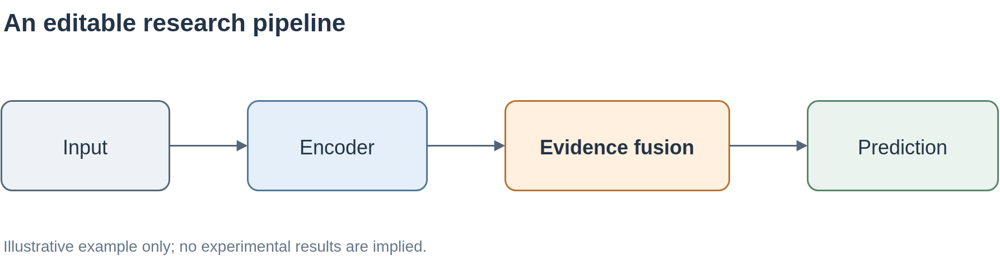

# Codex-with-Draw.io-4-figure

用自然语言描述论文图片，让 Codex、Claude Code 或 OpenCode 生成可编辑的 draw.io 源文件，再通过命令行导出 PNG、SVG 和 PDF。

本项目把一套服务器上的论文绘图工作流整理为可安装、可复用的工具。Agent 负责理解研究内容、编写与修改 XML；draw.io Desktop 负责渲染；Inkscape 默认负责将 SVG 转为 PDF，也可选择 CairoSVG。每位用户使用自己的系统账号和 Agent，无需创建专用 `codex` 账号。

**当前为 0.1.0 初版。** 三个平台都有交互式安装入口和手动指南。原生 Windows/macOS 的端到端测试仍待实际机器或 CI 验证；具体已验证内容见 [验证记录](docs/validation.md)。README 先维护中文版，英文绘图 skill 已包含在仓库中。



上图来自仓库自带的 [可编辑示例](examples/pipeline.drawio)，仅用于说明导出效果，不代表真实实验结果。

## 快速开始

下载本仓库 ZIP 并解压，或克隆仓库。打开终端，进入解压后的项目根目录，再运行对应命令。路径含空格时请给路径加引号。

| 平台 | 交互式安装入口 | 分步指南 |
| --- | --- | --- |
| Windows 10/11 | `powershell -NoProfile -ExecutionPolicy Bypass -File .\install\windows.ps1` | [Windows](docs/windows.md) |
| macOS | `bash install/macos.sh` | [macOS](docs/macos.md) |
| Linux | `bash install/linux.sh` | [Linux](docs/linux.md) |

Windows 的命令只对这一次 PowerShell 进程调整脚本执行策略。企业策略禁止脚本时，可按手动指南直接运行 Python 配置器。

安装器会：

1. 检查 Python 3.10+，必要时通过本机软件源安装。
2. 检测并复用 draw.io；缺失时通过 GitHub 官方 release、Homebrew 或 winget 安装。
3. 询问 PDF 后端，默认 Inkscape；Linux 补齐 Xvfb/xauth，用虚拟显示导出。
4. 让你选择 Codex、Claude Code、OpenCode，可安装到一个或多个 Agent。
5. 安装英文 `drawio-paper-figures` skill，生成带本机路径的中文提示词。
6. 询问是否配置用户 PATH，并实际导出测试图，检查 PNG/SVG/PDF 文件与 SVG 文字。

安装系统应用时，操作系统可能要求管理员密码；工作流、skill 和提示词默认安装在当前用户目录。安装器不负责 Agent 的账号登录。建议先关闭已打开的 draw.io Desktop 窗口再执行导出测试。

安装结束后重新打开终端与 Agent。复制安装器打印出的 `START-HERE.md` 中的提示词，填写研究材料即可开始。测试图也需要打开检查文字、箭头和字体；自动测试通过不代表所有复杂图都已经视觉验证。

## 使用方式

```bash
drawio-render doctor --pdf-engine inkscape
drawio-render self-test --output-dir diagrams/out
drawio-render diagrams/in/figure.drawio diagrams/out/figure.png png 2
drawio-render diagrams/in/figure.drawio diagrams/out/figure.svg svg 1
drawio-render diagrams/in/figure.drawio diagrams/out/figure.pdf pdf 1
```

输出格式可以从扩展名推断，例如 `drawio-render input.drawio output.png`。PNG 默认放大 2 倍；JPG 同样支持。PDF 固定先导出 SVG，再调用所选转换器；也支持已有 SVG 作为 PDF 输入。首版每个源文件只处理一页，多页图请先拆分。

PNG 使用普通图片导出，可编辑源文件单独保存在 `.drawio` 中；SVG 会嵌入源图数据。若安装时选择不启用 PDF，使用 `self-test --skip-pdf`。

如果 PATH 尚未生效，请使用安装器打印出的完整命令路径。Windows PowerShell 运行带空格的完整路径时使用 `& 'C:\...\drawio-render.cmd' ...`。安装器生成的提示词直接调用绝对路径的 Python 和渲染器，不依赖 PATH。

## 一份完整的绘图提示词

下面内容可以复制给 Agent。安装后的 [提示词模板](prompts/paper-figure.zh.md) 会自动填入本机路径；这里使用 PATH 上的 `drawio-render`。

```text
请根据我提供的材料，为论文绘制一张可编辑、可用于投稿的图片。

材料路径：[论文或方法说明的路径]
图的类型：[总体框架 / 方法细节 / 流程 / 概念解释]
核心信息：[本图要让读者理解什么]
必须保留的模块、变量与关系：[填写；没有则从材料提取]
参考图：[路径或“无”]
图内语言：[英文 / 中文]
目标尺寸：[单栏 / 双栏 / 指定尺寸]
配色与风格：[简洁学术风格，或具体要求]
输出文件名：[例如 method_overview]

请使用 drawio-paper-figures skill。先阅读材料，梳理模块和连接关系；
材料足够时直接完成绘图，不要捏造机制、实验数据或改变公式含义。
对真正影响图意的信息缺口再提问，版式细节自行选择并说明必要假设。

创建一页原生 draw.io XML，源文件保存为 diagrams/in/<文件名>.drawio，
导出到 diagrams/out/。所有模块、连线和文字保持可编辑，文字使用 html=0，并禁用 whiteSpace=wrap 自动换行，必要时用显式换行。
以图意清楚、字号可读、连线准确、留白合理为准，避免堆砌装饰。

用本机 drawio-render 包装器导出 PNG（png 2）、SVG（svg 1）和 PDF（pdf 1）。
PDF 必须走 SVG → Inkscape 或已配置的 CairoSVG，不直接用 draw.io 导出 PDF。
打开 PNG 预览和 PDF，检查文字、箭头、字体、裁切和重叠问题；
有问题就修改源 XML 并重新导出。大图先生成长边不超过 1600 像素的预览。

最后提供源 .drawio、PNG、SVG、PDF 的绝对路径链接，说明主要设计，
并明确任何尚未验证的输出或字体问题。
```

已有图片的修改请求可使用 [修图提示词](prompts/revise-figure.zh.md)。适合本工作流的是架构图、方法图和概念图；实验统计曲线仍应由实际数据和绘图代码生成。

## 安装位置与常用选项

| 内容 | 默认位置 |
| --- | --- |
| Linux/macOS 工作流 | `~/.local/share/codex-drawio` |
| Windows 工作流 | `%LOCALAPPDATA%\CodexDrawio` |
| Codex skill | `~/.agents/skills/drawio-paper-figures` |
| Claude Code skill | `~/.claude/skills/drawio-paper-figures` |
| OpenCode skill | `~/.config/opencode/skills/drawio-paper-figures`，遵循 `XDG_CONFIG_HOME` |

这些 Agent 的 skill 目录依据各自官方说明，参考 [来源](docs/sources.md)。支持原生 Windows；在 WSL 中使用 Linux 入口，并在 WSL 内安装完整依赖。

```bash
# 多个 Agent
bash install/linux.sh --agents codex,claude,opencode
# 项目级 skill；工作流仍装入专用用户目录
bash install/linux.sh --scope project --project /absolute/project/path
# 已自行装好软件，只配置工作流
bash install/linux.sh --skip-software
# 可选 CairoSVG（Windows 还需要可加载的原生 Cairo DLL）
bash install/linux.sh --pdf-engine cairosvg
# 自动化：显式同意所选组件；默认不改 PATH，除非指定 --add-to-path
bash install/linux.sh --yes --agents codex --add-to-path
```

macOS 替换入口为 `install/macos.sh`；Windows 在 PowerShell 入口后传同名参数即可。完整参数运行 `python3 scripts/setup_workflow.py --help`（Windows 用 `python`）。常用参数还有 `--prefix`、`--drawio`、`--inkscape`、`--pdf-engine none`、`--skip-test`、`--skip-path`。`--skip-test` 会明确记录“配置完成但未测试”。Linux 默认下载最新 release；可用 `--drawio-version X.Y.Z` 指定下载版本，已有安装始终复用。

重复安装会备份已有的同名 skill 和工作流资源目录，备份名带 `.backup-时间戳`。请使用专用安装目录；安装器拒绝覆盖未标记的非空目录。没有自动卸载系统应用；移除方式见 [故障排查与维护](docs/troubleshooting.md)。

## 文件结构

```text
install/       三平台交互式入口
scripts/       共用安装配置器与 drawio-render
skills/        全英文绘图 skill
prompts/       中文绘图与修图模板
examples/      可编辑的通用测试图
docs/          分平台手动指南、排障、验证与发布说明
tests/         渲染与安装行为的回归测试
.github/       三平台代码检查与可手动触发的实际导出测试
```

本项目不包含原始私人对话、服务器账号配置、凭据或原始 Word 文档。代码与原创模板采用 [MIT License](LICENSE)；第三方软件遵循各自许可，见 [第三方说明](THIRD_PARTY_NOTICES.md)。

开发与贡献参见 [CONTRIBUTING.md](CONTRIBUTING.md)。维护者准备发布时请阅读 [发布说明](docs/releasing.md)。
